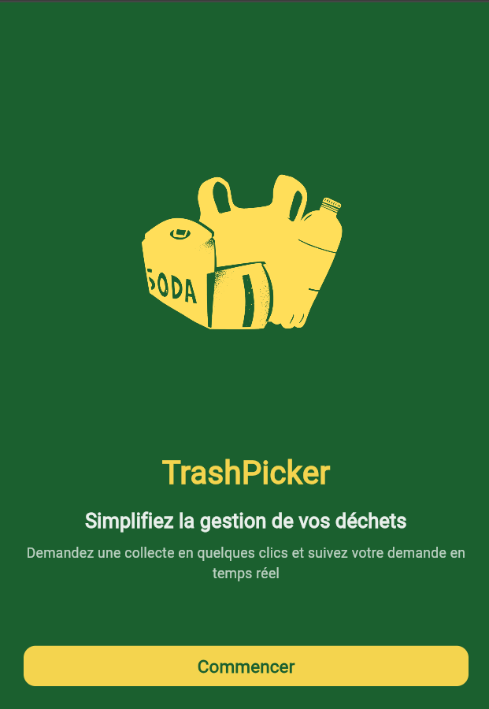
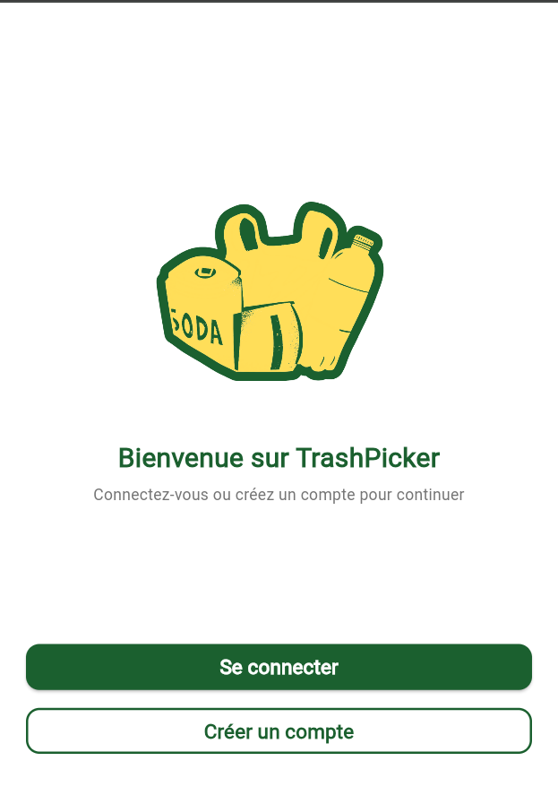
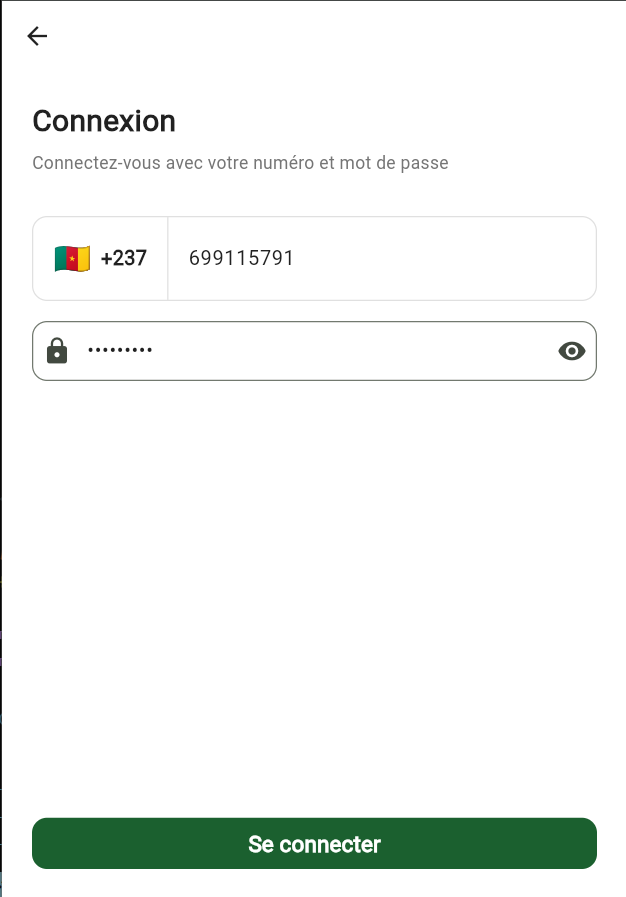

# TrashPick


## The Problem

In my neighborhood, I noticed waste pickers go door-to-door collecting trash from households. It's simple work, but it's chaotic. Households don't know when the picker will come. Pickers don't know which houses want their service today. There's no coordination, no way to pay reliably, no way to track who's picking up what.

It's just an inefficiency waiting to be solved.

---

## The Solution

**TrashPick** is a mobile app that connects households with waste pickers in real time. Instead of hoping someone shows up, households request a pickup. Instead of guessing demand, pickers know exactly where they're needed. Simple.

  

### How It Works

**For Households:**
- Request a waste pickup in a few taps through a mobile app
- Choose a convenient time and location
- Track your picker in real time
- Pay securely through the app
- Schedule recurring pickups if you prefer

**For Pickers:**
- Receive pickup requests directly on your phone
- Know exactly where to go and when
- Build a customer base
- Get paid reliably through the app
- Track your earnings

**For Admins:**
- Monitor the network in real time
- See where demand is highest
- Manage pickers and households
- Track payments and performance
- Identify patterns to grow the service

---

## Key Features


- **Real-time Request & Dispatch** - Households request; pickers accept instantly
- **GPS Tracking** - Know where your picker is
- **Flexible Scheduling** - One-time or recurring pickups
- **Secure Payments** - In-app payments, transparent pricing
- **Picker Analytics** - Earnings tracking, customer ratings
- **Admin Dashboard** - Real-time network monitoring
- **Reputation System** - Ratings reward reliable service

---

## Technical Stack

| Layer | Technology |
|-------|-----------|
| **Frontend** | Flutter (iOS/Android/Web) |
| **Backend** | Firebase (Auth, Firestore) |
| **Database** | Firebase Firestore |
| **State Management** | GetX |
| **Maps & Geolocation** | flutter_map (OpenStreetMap) + Geolocator |
| **Image Storage** | Cloudinary |
| **Real-time Communication** | Firebase Firestore |

---

## Getting Started

### For Contributors

```bash
git clone https://github.com/yourusername/trashpick.git
cd trashpick
flutter pub get
flutter run
```

### For Feedback

Have thoughts? Found a bug? [Open an issue](https://github.com/txchrixo/trashpick/issues) or reach out.

---

## License

TrashPick is open source under the MIT License. See [LICENSE](./LICENSE) for details.

---

**TrashPick: A simple app solving a simple problem.**